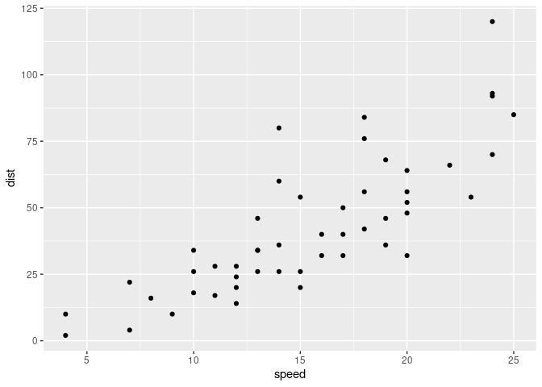
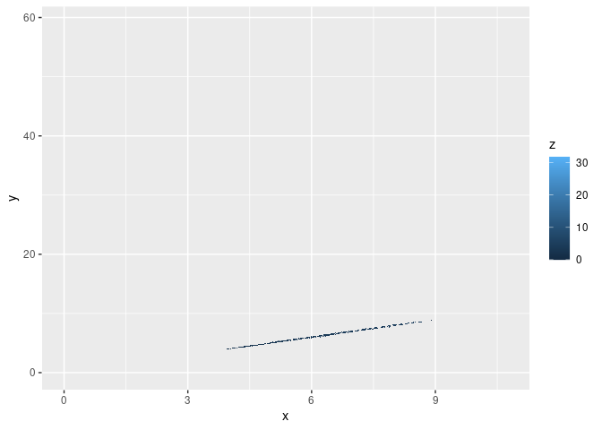

Test:

``` r
library(ggplot2)
qplot(speed, dist, data=cars)
```



Vertical or Horizontal Barplot:

``` r
qplot(x=cut, fill=color, data=diamonds) + 
    theme(plot.background = element_rect(fill="lightblue"))
```

%20barplot-1.png)

Grouped or stacked bar chart:

``` r
ggplot(data=diamonds, aes(fill=color, y=price, x=cut)) +
    geom_bar(position="dodge", stat="identity")
```


Heatmap:

``` r
ggplot(data=diamonds, aes(X=x, Y=y, fill = z)) + 
    # geom_tile(x, y, data=diamonds) + 
    scale_fill_gradient()
```


