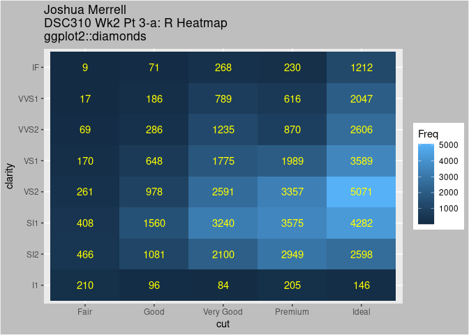

``` r
library(ggplot2)
```

Vertical or Horizontal Barplot
------------------------------

``` r
qplot(x=cut, fill=color, data=diamonds) + 
    theme(plot.background = element_rect(fill="gray")) + 
    ggtitle("Joshua Merrell\nDSC310 Wk2 Pt 1-a: R Barplot\nggplot2::diamonds")
```

%20barplot-1.png)

Grouped or stacked bar chart
----------------------------

``` r
ggplot(data=diamonds, aes(fill=clarity, x=cut)) +
  geom_bar(position="dodge") +
  theme(plot.background = element_rect("gray")) +
  ggtitle("Joshua Merrell\nDSC310 Wk2 Pt 2-a: R Grouped Barplot\nggplot2::diamonds")
```


Heatmap:
--------

``` r
ggplot(as.data.frame(table(diamonds[ ,c("cut", "clarity")])), 
       aes(x = cut, y = clarity)) + 
  geom_tile(aes(fill = Freq)) +
  geom_text(aes(label = Freq), col = 'yellow') + 
  theme(plot.background = element_rect("gray")) +
  ggtitle("Joshua Merrell\nDSC310 Wk2 Pt 3-a: R Heatmap\nggplot2::diamonds")
```


